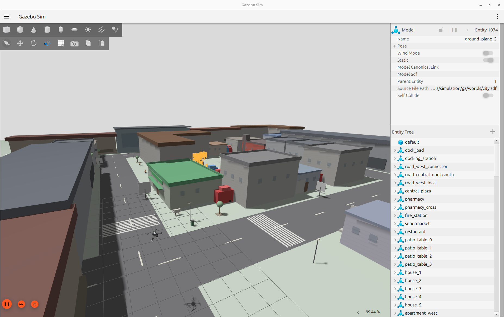

# PX4-Autopilot Fire Drone Edition

This repository is a customized version of the official PX4 Autopilot project:

Official PX4 Repository: https://github.com/PX4/PX4-Autopilot

## Description

This version was modified for autonomous fire-drone simulation and ROS 2 integration.

The following additions and customizations were made:

* Added a custom **X500 Fire Drone** model
* Integrated a **Velodyne LiDAR sensor**
* Integrated a **monocular RGB camera**
* Added a customized **City world/environment**
* Modified simulation setup for autonomous exploration, mapping, and fire detection experiments

## Simulation Screenshot


## Features

* PX4 SITL simulation
* Gazebo simulation support
* Velodyne point cloud generation
* Mono camera image streaming
* ROS 2 compatible setup
* Custom drone model for fire detection/navigation research
* Custom city simulation world

## Notes

This repository is based on the official PX4 project and preserves PX4 licensing and structure.

Only the simulation models, sensor integrations, worlds, and related configuration files were customized for this project.

For complete PX4 setup instructions, dependencies, and documentation, please refer to the official PX4 repository and documentation.

## Build Instructions

Clone the repository:

```bash
git clone --recursive https://github.com/hadi-shokor/PX4-Autopilot-fire-drone.git
cd PX4-Autopilot-fire-drone
````

Initialize submodules:

```bash
git submodule update --init --recursive
```

Build PX4 SITL:

```bash
make px4_sitl
```

Run the custom drone simulation:

```bash
PX4_GZ_NO_FOLLOW=1 PX4_GZ_WORLD=city PX4_GZ_MODEL_POSE="-5,2,2,0,0,3.14" make px4_sitl gz_x500_fire_drone

```

## Author

Hadi Shokor


